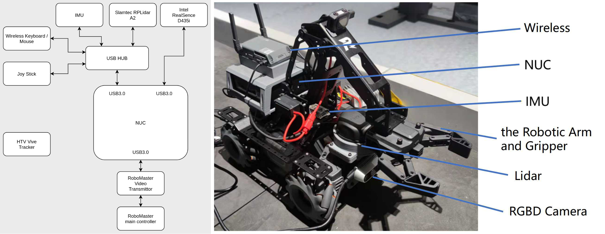
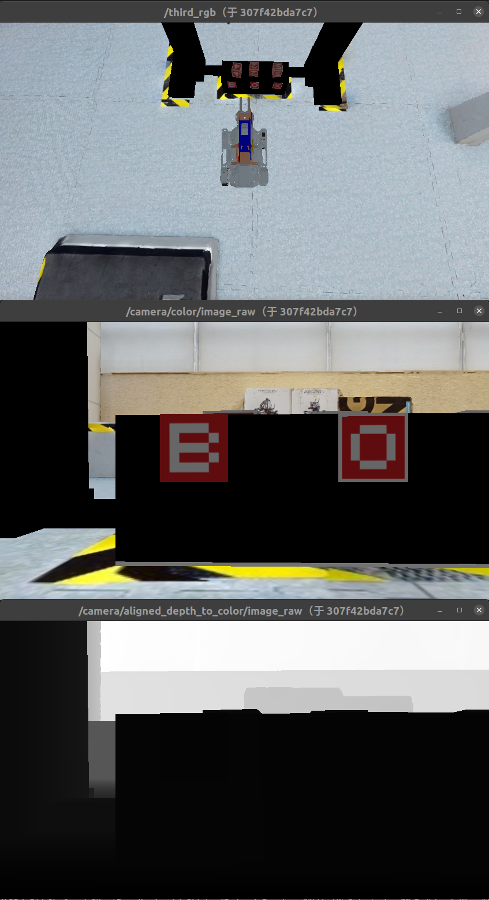
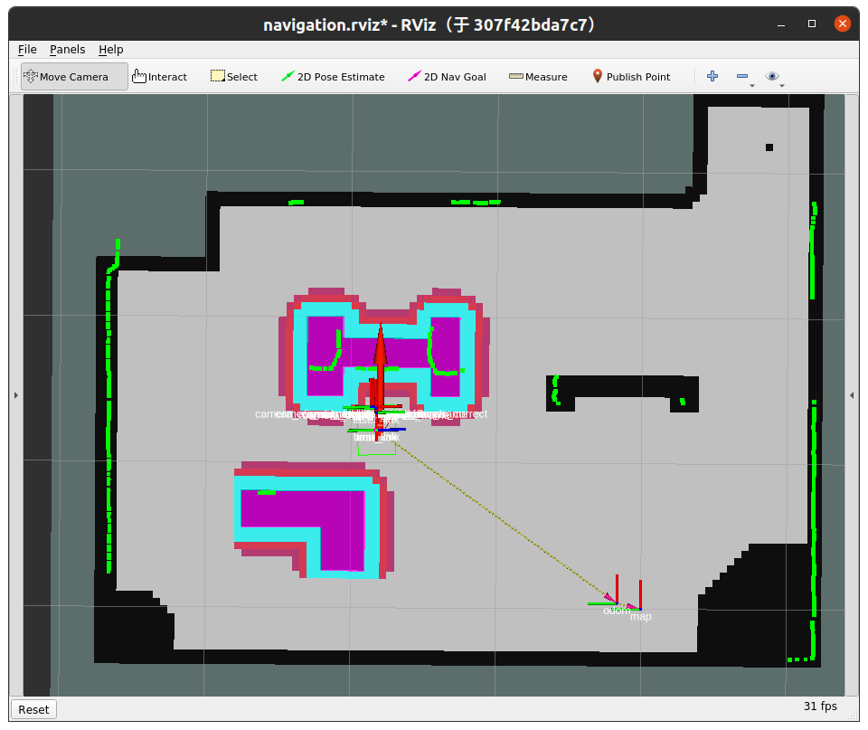
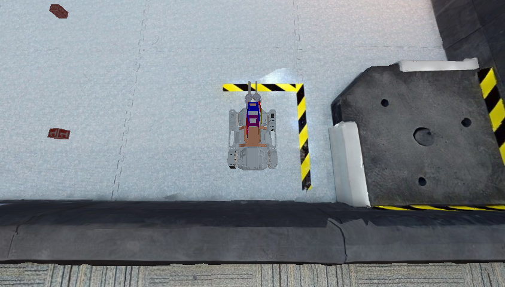
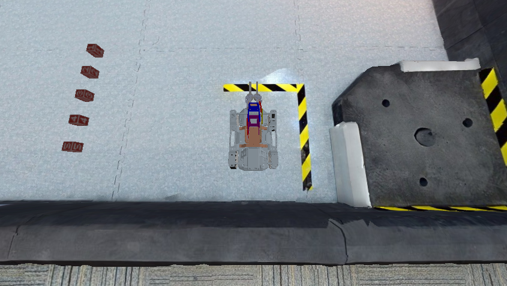
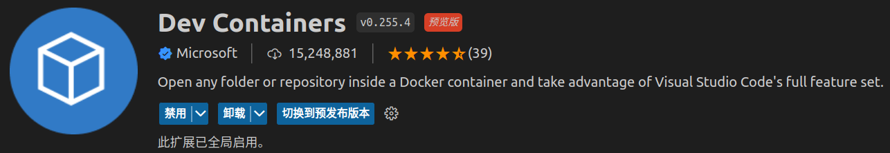
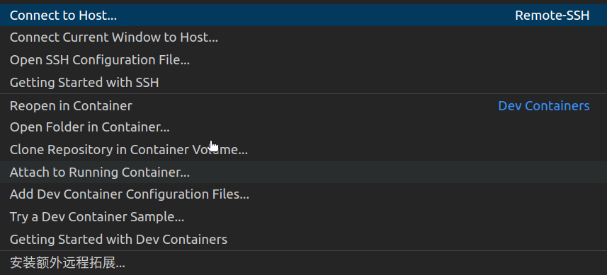

# ICRA Robomaster Sim2Real Challenge Client Baseline

## Hardware - EP

The [RoboMaster EP](https://www.dji.com/cn/robomaster-ep) is an autonomous vehicle platform equipped with a 4-axis palletizing robot arm and an encircling gripper for flexible gripping action, inspired by DJI's annual RoboMaster robotics competition. It provides Mecanum wheel omnidirectional movement, a fast wireless data link system including a real-time video stream, and an open SDK for further development and programming.

In order to match the theme of Sim2Real, we equip the RoboMaster EP with an external computing platform (NUC), as well as additional sensors, including **onboard lidar** and **RGB-D cameras**, for better perception of the environment.

An external computing platform is also prepared to communicate with EPs through the RoboMaster EP SDK. This platform is dedicated to running real applications in both simulated and real environments.



The specifications of the equipped NUC are listed as follows:

| Model      | CPU        | RAM     | SSD     |
|  :--------------------: | :----------------------: | :----------------------: | :----------------------: |
|  NUC11PAHI7 | i7-1165G7 (2.8GHz, 8 Cores) | 8GB | 256GB |

## Software Architecture - Sim

```mermaid
graph LR

A([ROS Master])

S([Server])

C([Client])

subgraph Net Bridge

S-..ROS topics..->C

C-..ROS topics..->S

C---A
A---S

end
```

### Core (ROS Master)

This part serves as the communication pivot in ROS systems.

### Server

In stage 1, the task is performed in the simulated scene. Therefore, we build a digital twin of the testing scene in reality with `habitat-sim` and `habitat-lab`. This digital twin contains a refined simulation of the testing ground used in the later stage as well as the simulation of the EP itself.

The interfaces between the server and client are defined by ROS topics, and detailed definitions can be found [here](./reference.md).

### Client

In this repo, we provide a baseline method for this task. A functional image can be obtained by [building the image](#build-an-updated-client-image) or pulling `tb5zhh/icra-2023-client:latest`.

Note that, due to the hardware resource constraints on EP, a launched client should be limited to using less than 6 CPUs and 8192MB memory. These constraints are imposed by the `--cpus=5.6 -m 8192M` arguments in `launch.sh. Do not remove them during development, or online testing performance may be significantly lower than local testing.

The baseline image (and potentially the images you built) is based on the base image `docker.discover-lab.com:55555/rm-sim2real/client-base:v1.4.0`. Basic functional units (e.g. [keyboard control](#manually-control-ep-with-keyboard)) are included in this base image. Please refer to [this repo](https://github.com/AIR-DISCOVER/ICRA-RM-Sim2Real-Client) for further information on the base image.

## How-to

### Launch server and client

The launching script `launch.sh` will create the docker network, the communicating core, the server and client container respectively:

```shell
scripts/launch.sh
```

You can change the images used by specifying the environment variables `SERVER_IMAGE` and `CLIENT_IMAGE`:

```shell
# Suppose your client image is client-test:latest
CLIENT_IMAGE=client-test:latest scripts/launch.sh
```

This is especially useful when you are launching with the client image you built locally. 

By default, if the launch is successful, three `image-view` windows and one `cartographer` window would appear on the screen:





### Launch server and create client container without running

If you wish to launch the simulation server and then create the client container without automatically starting the game, execute `launch.sh` with an additional start-point.

This is typically used for debugging before launching individual components of the client:

```shell
scripts/launch.sh bash
```

The visualization output should be the same as the [part above](#launch-server-and-client) (since the server is launched in the same way).

### Stop server and client

This script will stop all running containers and remove the network right away:

```shell
scripts/halt.sh
```

### Create a shell for the client

This script will open a shell inside the client:

```shell
scripts/shell.sh
```

Note that, by default ROS commands (e.g. `rostopic`, `roslaunch`, `rosrun`) are ready to use without additional setup (no need to source `setup.bash` file).

Also, any changes made in a running container **DOES NOT** persist. It is suggested to use the shell for debugging only and use `docker build` (see [build the container](#build-the-container)) for persistent changes.

### Execute command inside the client

`shell.sh` also accepts commands as arguments. For example:

```shell
scripts/shell.sh rostopic list -v
```

### Manually control EP with keyboard

Use `scripts/kbd_control.sh` to manually control EP:

```shell
scripts/kbd_control.sh
```

Control reference:

* `i`: Move forward
* `j`: Rotate counter clock-wise
* `l`: Rotate clock-wise
* `,`: Move backward
* `J`: Move horizontally to left
* `L`: Move horizontally to right
* `k`: Stop moving
* `q`: Increase robot speed
* `z`: Decrease robot speed
* `1`: Lower robot arm
* `2`: Lift robot arm
* `3`: Close gripper
* `4`: Open gripper
* `Ctrl + C`: Stop listening keyboard inputs

### Display the timer for placing minerals

`judging.sh` invokes `rostopic echo` which prints the `/judgement/markers_time` on the screen:

```shell
scripts/judging.sh
```

### Set the positions of minerals

We provide ROS interfaces for manually placing the minerals in the simulated environment.
By default, the minerals are arranged in the same way of [RM Sim2Real 2022](https://github.com/AIR-DISCOVER/ICRA-RM-Sim2Real).

To place the minerals at random positions: 

```shell
docker exec -it client /opt/ros/noetic/env.sh /opt/workspace/devel_isolated/env.sh /opt/ep_ws/devel/env.sh rostopic pub -1 /reset geometry_msgs/Point "x: 0.0
y: 0.0
z: 0.0"
```

The x, y, and z values represent the index numbers of the minerals to be exchanged.

If the values of x, y, and z are not between 1 and 5 or the same, they will be set randomly.



To place the minerals at manually specified positions: (The `PoseArray` should have 5 entries)

```shell
docker exec -it client /opt/ros/noetic/env.sh /opt/workspace/devel_isolated/env.sh /opt/ep_ws/devel/env.sh rostopic pub -1 /pose_set geometry_msgs/PoseArray "header:
  seq: 0
  stamp:
    secs: 0
    nsecs: 0
  frame_id: ''
poses:
- position:
    x: 3.0
    y: 0.0
    z: 3.0
  orientation:
    x: 0.0
    y: 0.0
    z: 0.0
    w: 1.0
- position:
    x: 3.0
    y: 0.0
    z: 3.15
  orientation:
    x: 0.0
    y: 0.0
    z: 0.0
    w: 1.0
- position:
    x: 3.0
    y: 0.0
    z: 3.3
  orientation:
    x: 0.0
    y: 0.0
    z: 0.0
    w: 1.0
- position:
    x: 3.0
    y: 0.0
    z: 3.45
  orientation:
    x: 0.0
    y: 0.0
    z: 0.0
    w: 1.0
- position:
    x: 3.0
    y: 0.0
    z: 3.6
  orientation:
    x: 0.0
    y: 0.0
    z: 0.0
    w: 1.0

"
```

If the number of poses is less than five or if the pose is invalid, it will be set to a random value.



### Use Visual Studio Code to debug

Install the extension for remote developing of the docker container (ms-vscode-remote.remote-containers):



Click the remote development button in the left-bottom corner and then select "Attach to Running Container":



Then choose the running client container (i.e., `/client`) and then open the folder `/opt/ep_ws/src`. Now you should be able to make changes directly to the files inside the docker.

Note that any changes made in this way **DOES NOT** persist. Once the container is stopped and removed, changes will be lost. It is suggested to use the shell for debugging only and use `docker build` (see [build the container](#build-the-container)) for persistent changes.

### Build an updated client image

A `Dockerfile` is included in this repository. To build a newer client image, execute:

```shell
# Build with name `client-custom` and tag `latest`
docker build . -t client-custom:latest
```

By default, the codes for controlling are located in `src/` (`src/` in this repo). When building a client image, all codes under `src/` will be copied to `/opt/ep_ws/src/rmus_solution` in the image. 

Inside the image, `/opt/ep_ws` is the ROS workspace directory. Later in the dockerfile, `catkin_make` is run in this directory.

The entry for the client is fixed to `start.sh` in the root of repo. When the image is building, this script is copied to `/opt/start.sh` and serves as the main entry for the client. The content of this file can be changed arbitrarily to suit the requirements,** but the name of the script (`start.sh`) should not be changed**.

If additional apt and pip requirements are needed in the newer image, please modify `Dockerfile` to obtain these packages at compile time.

Change these lines to add more `apt` dependencies:

```Dockerfile
# Install extra dependencies with apt
RUN apt-get update && \
     apt-get install -y --no-install-recommends \
     ros-noetic-depthimage-to-laserscan ros-noetic-map-server python3-tf-conversions ros-noetic-global-planner && \
     rm -rf /var/lib/apt/lists/* && apt-get clean
```

Change these lines to add more `pip` dependencies:

```Dockerfile
# Install extra dependencies with pip
RUN pip3 install -i https://pypi.tuna.tsinghua.edu.cn/simple scipy
```

### Submit the image

Submitting images requires registering for the ICRA Robomaster Sim2Real challenges. Please [sign up](https://air.tsinghua.edu.cn/robomaster/sim2real_icra23.html) before proceeding.

After registration, you will be authorized the access to our [docker registry](https://docker.discover-lab.com:55555). We will provide these infomation:

* `username`: registry login username
* `password`: initial registry login password. Change it asap on the [website](https://docker.discover-lab.com:55555)
* `project name`: the project name of your team in the registry, which corresponds to your team name
* `inquire hash`: url suffix for results inquiry. detailed later

If you wish to submit the image for online testing, please first log in:

```shell
docker login docker.discover-lab.com:55555
```

You will be prompted to enter your username and password, which are the same as the username and password of the [registry](https://docker.discover-lab.com:55555).

Then, build your image:

```shell
CLIENT_IMAGE=docker.discover-lab.com:55555/[project_name]/client:[tag] bash scripts/build.sh
```

Replace `[project_name]` with your project name in the registry. To request a simulation test, `[tag]` should starts with `sim-`. To request a real test, `[tag]` should starts with `real-`. Note that, images whose name are not `client` will be ignored by the online testing system.

After that, push your image to our registry:

```shell
docker push docker.discover-lab.com:55555/[project_name]/client:[tag]
```

You may find the testing result of your images on `https://sim2real.discover-lab.com:11011/list/[inquire_hash]`. 

### Copy files from/to server/client containers

You may refer to [this page](https://docs.docker.com/engine/reference/commandline/cp/) for copying files between containers and the host.

Normally, when you need to update sources in the containers, you should change the source codes in this repo and refer to [this part](#build-an-updated-client-image) to build an updated image.
Directly copying files into containers should be used for debugging only.

## Routines

To invoke routines of indivisual components of the baseline, see [routines.md](./routines.md).

## Reference

See [reference.md](./reference.md).
