# 比赛操作

## 1. 遥控机器人

1.   运行server环境

     正确显示rgb、depth、third_rgb画面，如果出现错误，重启启动一次。

2.   运行client环境

     重启后需要执行一次

     ```
     sudo docker start sim2real_client
     ```

     新建terminal

     ```
     cd ICRA-RM-Sim2Real/docker_client
     ./exec_client.sh
     cd ~
     ```

3.   启动遥控节点

     新建terminal

     ```
     cd ICRA-RM-Sim2Real/docker_client
     ./exec_client.sh
     cd ~
     rosrun teleop_twist_keyboard teleop_twist_keyboard.py
     ```

     需要鼠标点击，激活键盘控制程序的terminal

     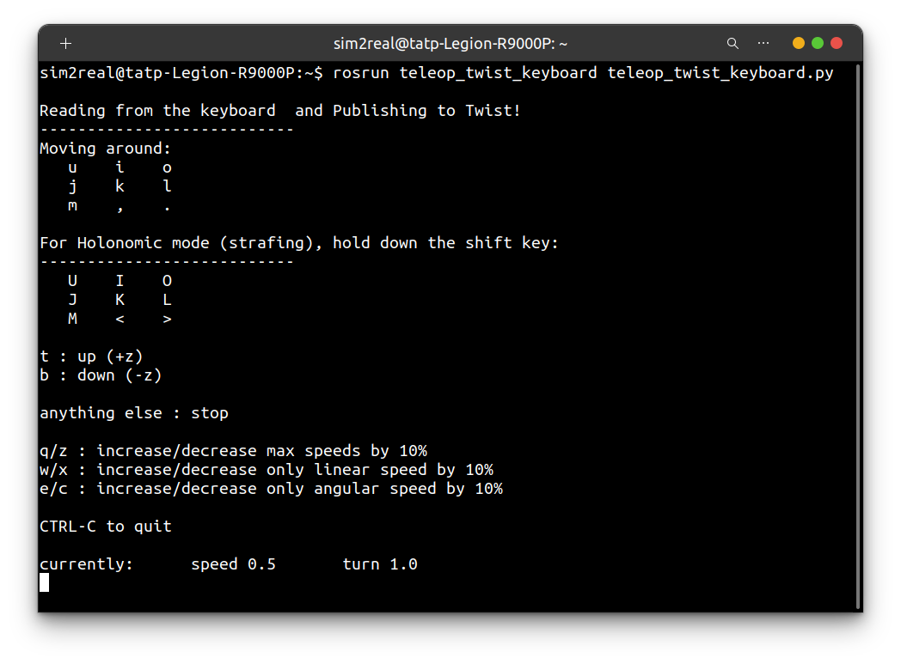按键q，z，增大和降低机器人速度

     按键i，j，，，l， 控制机器人前进后退和旋转

     按键I，J，<，L，控制机器人横向移动

     通过k，停止机器人运动

     按键1，移动机械臂到抓取位置

     按键2，移动机械臂到放置位置

     按键3，抓取矿石

     按键4，放置矿石

## 2. cartographer navigation

1.   运行server环境

2.   运行client环境


3.   启动导航节点

     在client的终端中输入：

     ```
     roslaunch carto_navigation navigation.launch
     ```

4.   通过rviz发送2D Nav Goal

     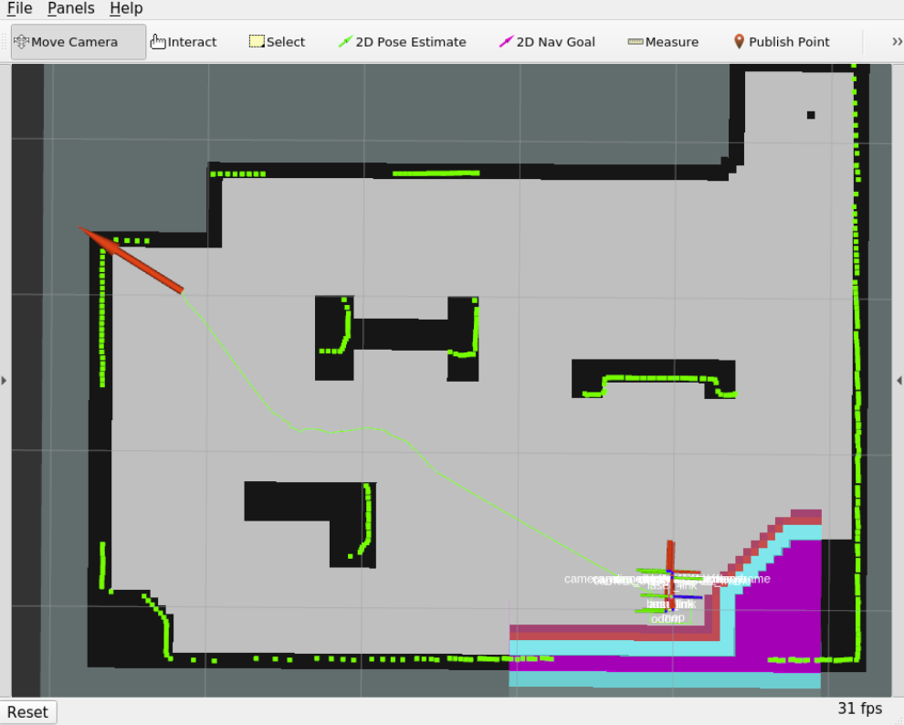

## 3. 方块检测

1.   运行server环境

2.   运行client环境


3.   启动视觉检测和抓取节点

     在client的终端中输入：

     ```
     roslaunch rmus_solution manipulate.launch
     ```

     如果出现报错可视化窗口闪退，重启一次

4.   遥控机器人到交换站前方

     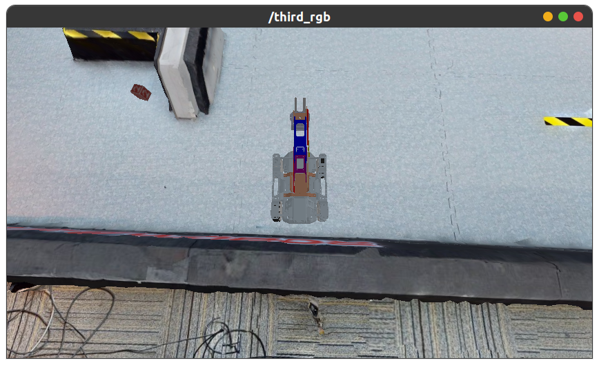

     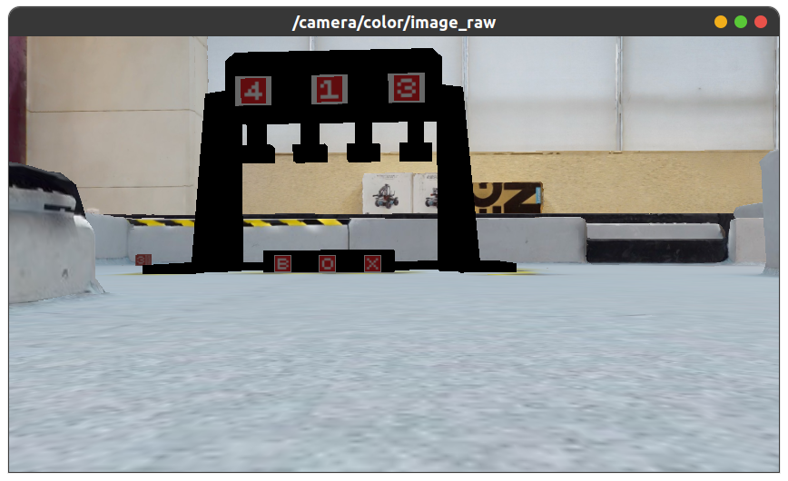

5.   调用视觉service，检测交换站上方数字

     新建终端

     ```
     cd ICRA-RM-Sim2Real/docker_client
     ./exec_client.sh
     cd ~
     rosservice call /image_processor_switch_mode "mode: 9"
     ```
     输入`rosservice call /image_processor_switch_mode`后按`tab`自动补全，注意mode参数为9。

     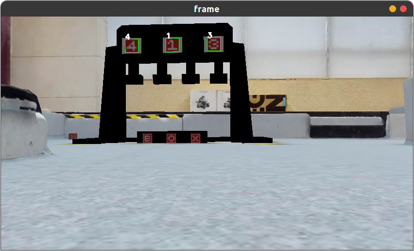

     识别到任务数字为`4,1,3`

     >   关于服务`image_processor_switch_mode`：
     >
     >   参数`mode`，类型uint8，可选值0~9，
     >
     >   | 数字 | 含义                      |
     >   | ---- | ------------------------- |
     >   | 0    | 静默（default）           |
     >   | 1-5  | 识别数字编号              |
     >   | 6-8  | 依次对应交换站方块B、O、X |
     >   | 9    | 识别交换站上方三个数字    |

6.   关闭视觉service

     在同一个终端内输入

     ```
     rosservice call /image_processor_switch_mode "mode: 0"
     ```

7.   遥控机器人到矿石前方

     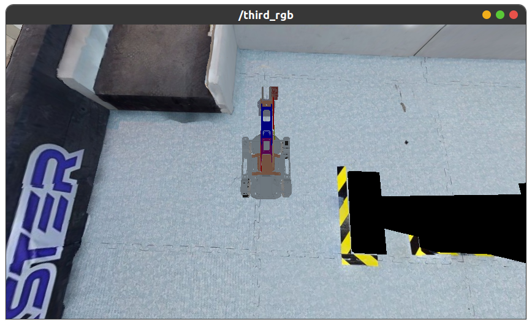

     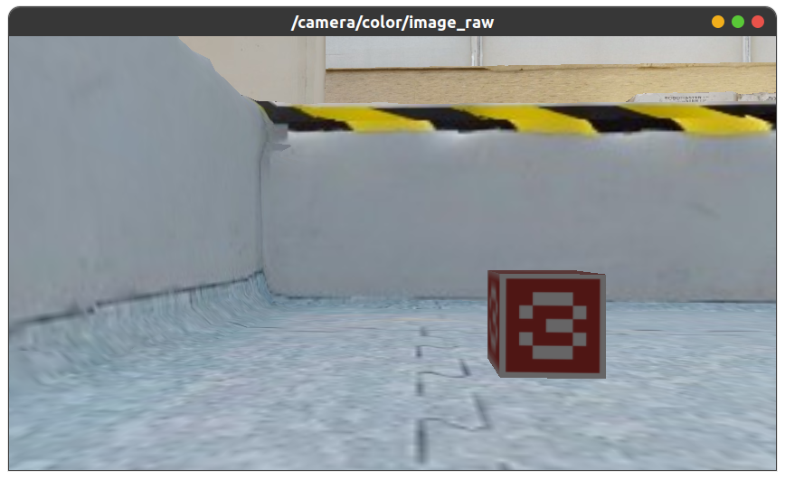

8.   调用视觉service，检测方块

     ```
     rosservice call /image_processor_switch_mode "mode: 3"
     ```

     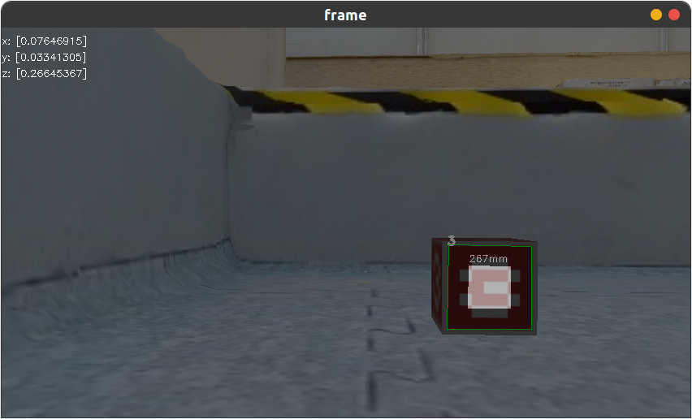

9.   抓取方块

     新建终端

     ```
     cd ICRA-RM-Sim2Real/docker_client
     ./exec_client.sh
     cd ~
     rosservice call /let_manipulater_work "mode: 1
     call: ''"
     ```

     输入`rosservice call /let_manipulater_work`之后按`tab`自动补全

     抓起方块后关闭视觉service

     ```
     rosservice call /image_processor_switch_mode "mode: 0"
     ```

     >   关于服务`let_manipulater_work`：
     >
     >   参数`mode`，类型uint8，可选值0~2，参数为1或2，需要先调用对应的视觉服务`image_processor_switch_mode`
     >
     >   | 数字 | 含义                                         |
     >   | ---- | -------------------------------------------- |
     >   | 0    | 将机械臂复位                                 |
     >   | 1    | 抓取前方的方块，对应视觉service1~5           |
     >   | 2    | 将抓到的方块放到交换站上，对应视觉service6~8 |
     >
     >   `call`为开放接口，留给选手自行开发，默认为空字符串。

10.   遥控机器人到交换站前

      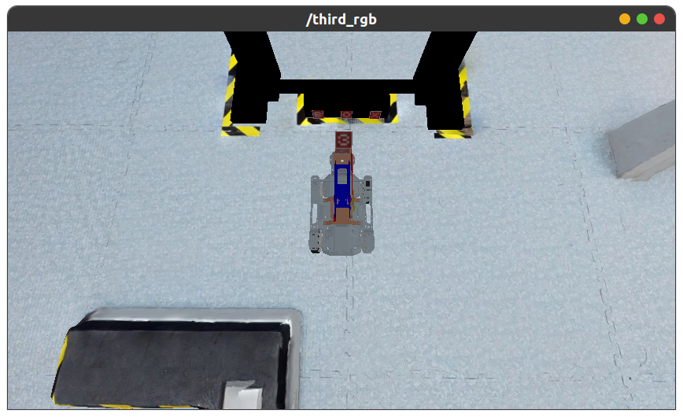

      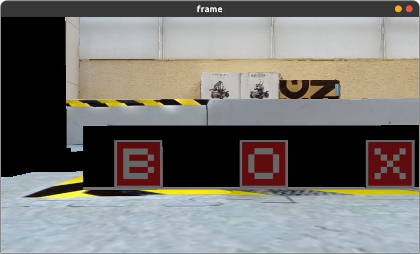

11.   调用视觉service，检测交换站marker

      将方块放在字母“O”对应的位置上，选择的服务参数对应：7

      ```
      rosservice call /image_processor_switch_mode "mode: 7" 
      ```

      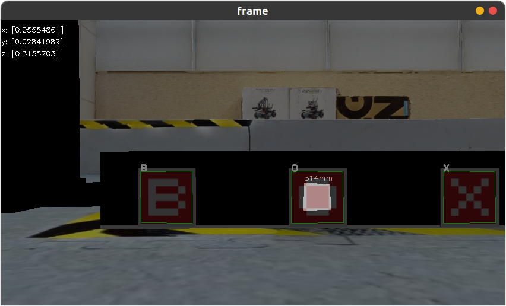

12.   放下方块

      ```
      rosservice call /let_manipulater_work "mode: 2
      call: ''"
      ```

      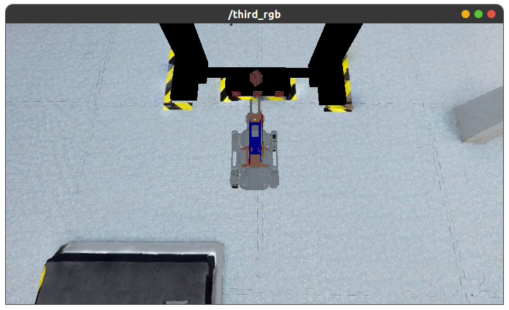

      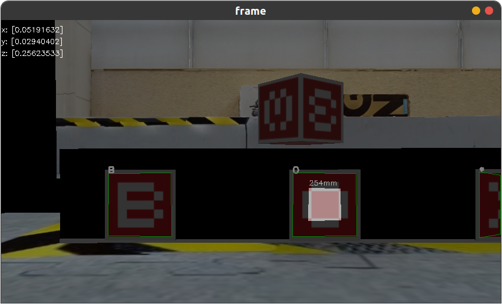

      关闭视觉服务

      ```
      rosservice call /image_processor_switch_mode "mode: 0"
      ```

## 4. 比赛任务

1.   运行server环境

2.   运行client环境


3.   启动比赛节点

     在client的终端中输入：

     ```
     roslaunch rmus_solution start_game.launch
     ```

     如果出现报错可视化窗口闪退，关闭进程，重启一次。

     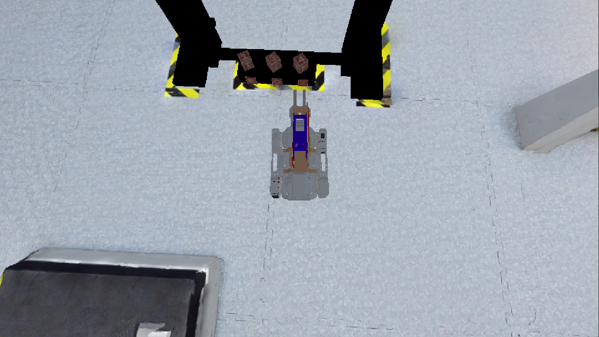

     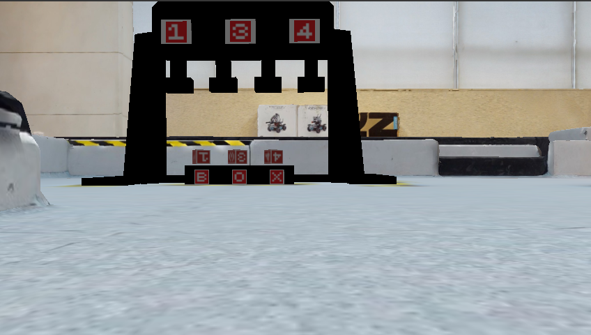
