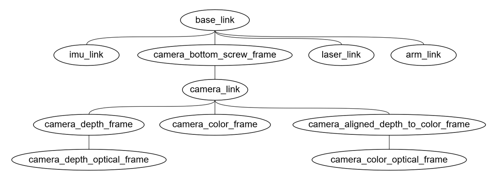
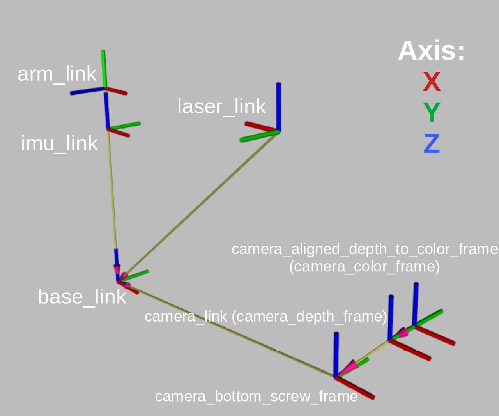
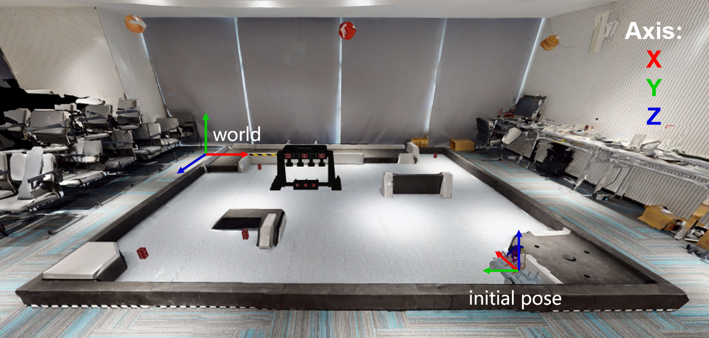

# Reference

## Robot Model
 
 
The discription file for the sensor locations is located at

`~/ep_ws/src/ep_description/urdf/ep_description.xacro`

The user should test the development in the `client` image at first.
<!-- 选手在实际开发过程中需要先在client镜像中先运行 -->

To show the static TF tree:

```bash
scripts/shell.sh roslaunch ep_description ep_description.launch
```

<!-- # 2. Hardware interface -->



EP Robot `tf_tree`



Robot frame axes:

<!-- <div data-zone-id="0" data-line-index="0" style="white-space: pre;"> -->

Coordinate system | Description | Origin according to `/base_link` (m)
-- | -- | --
`/base_link` | The robot center coordinate system is located at the center of the four Mecanum wheels, <br>and the height is on the plane where the centers of the four Mecanum wheels are located. | X Front Y Left Z Upper
`/laser_link` | Lidar coordinate | (0.12, 0, 0.085)
`/imu_link` | IMU coordinate | (0, 0, 0.08)
`/arm_link` | The base coordinate system of the robot arm | (0, 0, 0.1)
`/camera_bottom_screw_frame` | Realsense camera base screw positioning hole coordinate system, <br>as the standard for other coordinate systems of the camera | (0.155, 0, -0.008)
`/camera_link` | Realsense camera coodinate | (0.165, 0.0175, 0.005)
`/camera_depth_frame` | Depth coordinate of Realsense camera, sharing the same space with`/camera_link` | (0.165, 0.0175, 0.005)
`/camera_color_frame` | RGB coordinate of Realsense camera | (0.165, 0.0325, 0.005)
`/camera_aligned_depth_to_color_frame` | the coordinate of Realsense Depth image aligned to RGB coordinate, <br>sharing the same space with `/camera_color_frame` | (0.165, 0.0325, 0.005)

<!-- </div> -->

`/base_link`

​Robot center coordinate system, located at the center point of the 4 Mecanum wheel.

`/imu_link`

​IMU coordinate system, the same as `base_link`.

`/laser_link`

​2D LiDAR coordinate system, located at the centrer front of the vehicle.


## Equipped Sensors on EP

|Type|Model|Parameters|
|:-:|:-:|:-:|
|Lidar|[SlamTech Rplidar A2](https://www.slamtec.com/cn/Lidar/A2)|Scan Rate: $10hz$<br />Sample Rate: $16Khz$<br />Distance Range: $[10m, 25m]$<br />Minimal Operating Range: $0.2m$|
|IMU|[HiPNUC Hi226 6-axis IMU/VRU](https://www.hipnuc.com/product_hi226.html)|Frequency: $30hz$<br />Static Roll and Pitch Errors: $0.8°$<br />Static Roll and Pitch Angles Error Bound: $2.5°$<br />Bias Error of Gyroscope: $<10°/h$<br />Heading Angle Error When Moving (in 6-axis mode): $<10°$|
|RGB & Depth Camera|[Intel Realsense D435i](https://www.intelrealsense.com/zh-hans/depth-camera-d435i/)|Frequency: $30hz$<br />Resolution: $848\times480$<br />FOV: $69°\times42°$|
|Odometer|[RoboMaster SDK](https://github.com/dji-sdk/robomaster-sdk)|Frequency: $10hz$|

## Accurators

| Actuator                 | Recommend Range                                              |
| :------------------------: | :------------------------------------------------------------: |
| chassis velocity control | $0.1m/s\leq\|v_x\|\leq0.5m/s$ <br>$0.1m/s\leq\|v_y\|\leq0.5m/s$ <br>$0.01rad/s\leq\|v_{th}\|\leq0.5rad/s$ |
| chassis position control | $\|x\| \geq 0.1m$ <br>$\|y\| \geq 0.1m$ <br>$\|\theta\| \geq 0.1rad$ |
| arm end position control | while $0.09\leq x \leq 0.18$, should keep $y\ge 0.08$ <br>while $x>0.18$, should keep $y\ge -0.02$ |
| gripper control          | $x=1$ close gripper <br>$x=0$ open gripper                   |

## Environment and Coordinates Systems




The real environment are shown as above, along with the reference systems of the world and the EP.

The relative position of initial position of EP in the world reference is $(3.97, 0, 3.58)$.


## ROS topics 

Interation with (simulated) EP is done by **ROS topics**.

A complete list of subscribed/published rostopics are listed (`rostopic list -v`):

```
Published topics:
 * /rosout_agg [rosgraph_msgs/Log] 1 publisher
 * /rosout [rosgraph_msgs/Log] 7 publishers
 * /image_view_rgb/parameter_descriptions [dynamic_reconfigure/ConfigDescription] 1 publisher
 * /image_view_depth/parameter_updates [dynamic_reconfigure/Config] 1 publisher
 * /image_view_rgb/parameter_updates [dynamic_reconfigure/Config] 1 publisher
 * /image_view_depth/output [sensor_msgs/Image] 1 publisher
 * /image_view_rgb/output [sensor_msgs/Image] 1 publisher
 * /camera/color/image_raw [sensor_msgs/Image] 1 publisher
 * /camera/color/camera_info [sensor_msgs/CameraInfo] 1 publisher
 * /camera/aligned_depth_to_color/image_raw [sensor_msgs/Image] 1 publisher
 * /camera/aligned_depth_to_color/camera_info [sensor_msgs/CameraInfo] 1 publisher
 * /pointgoal_with_gps_compass [ros_x_habitat/PointGoalWithGPSCompass] 1 publisher
 * /gps [ros_x_habitat/PointGoalWithGPSCompass] 1 publisher
 * /imu/data_raw [sensor_msgs/Imu] 1 publisher
 * /tf [tf2_msgs/TFMessage] 1 publisher
 * /rplidar/scan [sensor_msgs/LaserScan] 1 publisher
 * /ep/odom [nav_msgs/Odometry] 1 publisher
 * /gripper_state [geometry_msgs/Point] 1 publisher

Subscribed topics:
 * /rosout [rosgraph_msgs/Log] 1 subscriber
 * /cmd_vel [geometry_msgs/Twist] 1 subscriber
 * /arm_gripper [geometry_msgs/Point] 1 subscriber
 * /arm_position [geometry_msgs/Pose] 1 subscriber
 * /cmd_position [geometry_msgs/Twist] 1 subscriber
```

Additional topics are used for debugging only:

```
Published topics:
 * /image_view_depth/parameter_descriptions [dynamic_reconfigure/ConfigDescription] 1 publisher
 * /image_view_third/parameter_descriptions [dynamic_reconfigure/ConfigDescription] 1 publisher
 * /image_view_third/parameter_updates [dynamic_reconfigure/Config] 1 publisher
 * /image_view_third/output [sensor_msgs/Image] 1 publisher
 * /third_rgb [sensor_msgs/Image] 1 publisher
 * /pose/cube_1 [geometry_msgs/Pose] 1 publisher
 * /pose/cube_2 [geometry_msgs/Pose] 1 publisher
 * /pose/cube_3 [geometry_msgs/Pose] 1 publisher
 * /pose/cube_4 [geometry_msgs/Pose] 1 publisher
 * /pose/cube_5 [geometry_msgs/Pose] 1 publisher
 * /position/target_1 [geometry_msgs/Point] 1 publisher
 * /position/target_2 [geometry_msgs/Point] 1 publisher
 * /position/target_3 [geometry_msgs/Point] 1 publisher
 * /pose/ep_world [geometry_msgs/Pose] 1 publisher
 * /judgement/exchange_markers [std_msgs/String] 1 publisher
 * /judgement/markers_time [std_msgs/String] 1 publisher

Subscribed topics:
 * /camera/aligned_depth_to_color/image_raw [sensor_msgs/Image] 1 subscriber
 * /camera/color/image_raw [sensor_msgs/Image] 1 subscriber
 * /third_rgb [sensor_msgs/Image] 1 subscriber
 * /pointgoal_with_gps_compass [ros_x_habitat/PointGoalWithGPSCompass] 1 subscriber
 * /gps/goal [move_base_msgs/MoveBaseActionGoal] 1 subscriber -->
```

### Sensor Topics

|Name|Type|Description|
|:-|:-|:-|
|`/ep/odom`|`nav_msgs/Odometry`|Odometer data, including robot pose and speed information, are obtained by DJI master control.|
|`/rplidar/scan`|`sensor_msgs/LaserScan`|The two-dimensional lidar scanning data, including scene scanning information, is acquired by lidar because the occlusion range of the robot body includes 270° in front of the robot.|
|`/imu/data_raw`|`sensor_msgs/LaserScan`|IMU sensor data, including rotation, velocity, and acceleration information, are collected by the IMU.|
|`/camera/color/camera_info`|`sensor_msgs/CameraInfo`|RGB color image camera intrinsic parameter information.|
|`/camera/color/image_raw`|`sensor_msgs/Image`|RGB color image data, acquired by Realsense.|
|`/camera/aligned_depth_to_color/camera_info`|`sensor_msgs/CameraInfo`|Depth camera information.|
|`/camera/aligned_depth_to_color/image_raw`|`sensor_msgs/Image`|Depth image data, acquired by Realsense and aligned to RGB color images.|

### Accurator Topics

|Name|Type|Description|
|:-|:-|:-|
|`/cmd_vel`|`geometry_msgs/Twist`|Velocity command for the EP chassis.<br />Recommended ranges:<br />$0.1m/s\leq\|v_x\|\leq0.35m/s$<br />$0.1m/s\leq\|v_y\|\leq0.35m/s$<br/>$0.1rad/s\leq\|v_{th}\|\leq0.5rad/s$|
|`/cmd_position`|`geometry_msgs/Twist`|Position command for the EP chassis.<br />Recommended ranges:<br />$0.1m\leq\|x\|$<br/>$0.1m\leq\|y\|$<br/>$0.1rad\leq\|theta\|$|
|`/arm_position`|`geometry_msgs/Pose`|Position control command for the Robotic arm.<br />Available ranges:<br/>$0.09\leq x \leq 0.18$:  $y\ge 0.08$<br />$x>0.18$:  $y\ge -0.02$|
|`/arm_gripper`|`geometry_msgs/Point`|The commands for gripper.<br />Close: $x=1$<br />Open: $x=0$|

Examples:

```shell
# Move EP forward for 0.1m
rostopic pub -1 /cmd_position geometry_msgs/Twist \
"linear:
  x: 0.1
  y: 0.0
  z: 0.0
angular:
  x: 0.0
  y: 0.0
  z: 0.0"
```

```shell
# Move the end of the robotic arm to x=0.09, y=0.1
rostopic pub -1 /arm_position geometry_msgs/Pose \
"position:
  x: 0.09
  y: 0.1
  z: 0.0
orientation:
  x: 0.0
  y: 0.0
  z: 0.0
  w: 0.0"
```

```shell
# the command issued now is tp close the gripper
rostopic pub -1 /arm_gripper geometry_msgs/Point \
"x: 1.0
y: 0.0
z: 0.0" 
```

### Other Topics

|Name|Type|Description|
|:-|:-|:-|
|`/pose/cube_N`|`geometry_msgs/Pose`|The position of the minerals.<br />The mineral mineral numbered with `N` start from 1 to 5, e.g. `/pose/cube_1`<br />|
|`/position/target_N`|`geometry_msgs/Point`|The position of the exchange stations.<br />The Exchange Station numbered with `N`, ordering from left to right as 1/2/3.<br /> For example, `/pose/target_1` corresponds to the place information of the leftmost Exchange Station:|
|`/judgement/exchange_markers`|`std_msgs/String`|The marker digits of the exchange stations in the format of `data: "3, 5, 2"`<br / >For debug only.|
|`/judgement/markers_time`|`std_msgs/String`|The time of placing the mineral mineral in the right exchange station, in the format of `data: "0, None, 102.366459608078"`.<br />Defined as:<br /> `nan`: waiting for the client<br />`0`: client EP robot has moved but the mineral is not placed in exchange station<br />`[float]`: elapsed time of the mineral get placed <br />`None`: hit the exchange station, or the minerals are not put in the right exchange station.<br />For debug only.|
