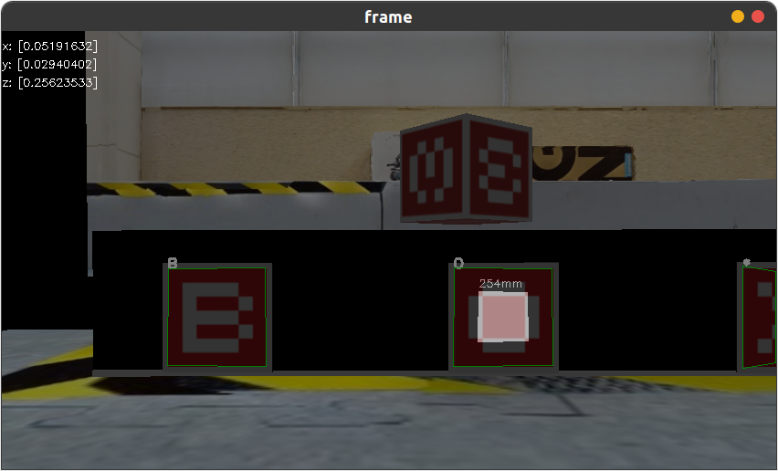

# Routines

In this section we provide instructions on launching individual components used in the baseline solution.

Before proceeding, you should follow instructions in [this section](./README.md#launch-server-and-create-client-container-without-running) to make sure the server is running and the client has been created.

## Cartographer Navigation

1. Launch a ROS node for navigation

   ```shell
   scripts/shell.sh roslaunch carto_navigation navigation.launch
   ```

2. Specify the navigation target by `rviz`:

   

## Detect a Mineral

1. Launch a node for detection and grasping:

   ```shell
   scripts/shell.sh roslaunch rmus_solution manipulate.launch
   ```

2. Move the EP [with keyboard](#cartographer-navigation) to the location where digits on the check station are visible.

   

3. Detect the digits on the check station by calling a ROS service:

   ```shell
   MODE=9
   docker exec -it client /opt/ros/noetic/env.sh /opt/workspace/devel_isolated/env.sh /opt/ep_ws/devel/env.sh rosservice call /image_processor_switch_mode "mode: ${MODE}"
   ```

   Note that, the command can be automatically completed by pressing `Tab`.

   After calling the service, the digits on the check station should be detected and visualized on the `image_view` output:

    

   > Reference for the service `/image_processor_switch_mode`:
   > 
   > `mode`:
   > > |Value|Specification|
   > > |:-:|:-:|
   > > | `0` | Halt (Default) |
   > > | `1` ~ `5` | Detect digits `1` ~ `5` |
   > > | `6` | Detect `B` |
   > > | `7` | Detect `O` |
   > > | `8` | Detect `X` |
   > > | `9` | Detect three digits on check station |

4. Stop the service by calling

   ```shell
   docker exec -it client /opt/ros/noetic/env.sh /opt/workspace/devel_isolated/env.sh /opt/ep_ws/devel/env.sh rosservice call /image_processor_switch_mode "mode: 0"
   ```

## Grasp a Mineral

1. Launch a node for detection and grasping:

   ```shell
   scripts/shell.sh roslaunch rmus_solution manipulate.launch
   ```

2. Move the EP [with keyboard](#cartographer-navigation) towards the front face of a mineral

   

3. Invoke vision service to locate the mineral 
   
   ```shell
   docker exec -it client /opt/ros/noetic/env.sh /opt/workspace/devel_isolated/env.sh /opt/ep_ws/devel/env.sh rosservice call /image_processor_switch_mode "mode: 5"
   ```

   > The parameter `3` corresponds to the digit 3 on the mineral to grasp.

   After calling the service, the digits on the mineral should be detected and visualized on the `image_view` output:

    

4. Grasp the mineral

   ```shell
   MODE=1
   docker exec -it client /opt/ros/noetic/env.sh /opt/workspace/devel_isolated/env.sh /opt/ep_ws/devel/env.sh rosservice call /let_manipulater_work "mode: ${MODE}
   call: ''"
   ```
   
   Note that, the command can be automatically completed by pressing `Tab`.

   > Reference for the service `/let_manipulater_work`:
   > 
   > `mode`:
   > > |Value|Specification|
   > > |:-:|:-:|
   > > | `0` | Robot arm reset |
   > > | `1` | Grasp the mineral in front of the EP |
   > > | `2` | Place the mineral at hand into the check station   |
   > 
   > `call`: Usused, default value is empty string. You can use this parameters in your method. 

5. Move the EP [with keyboard](#cartographer-navigation) to the front of the check station:

   
   
   

6. Find the target box to place the grasped mineral:

   ```shell
   docker exec -it client /opt/ros/noetic/env.sh /opt/workspace/devel_isolated/env.sh /opt/ep_ws/devel/env.sh rosservice call /image_processor_switch_mode "mode: 7"
   ```

   > `6`, `7`, `8` correspond to `B`, `O`, `X` at the checking station

   

7. Place the mineral in the box
   
   ```shell
   docker exec -it client /opt/ros/noetic/env.sh /opt/workspace/devel_isolated/env.sh /opt/ep_ws/devel/env.sh rosservice call /let_manipulater_work "mode: 2
   call: ''"
   ```

   

   

8. Stop the service

   ```shell
   docker exec -it client /opt/ros/noetic/env.sh /opt/workspace/devel_isolated/env.sh /opt/ep_ws/devel/env.sh rosservice call /image_processor_switch_mode "mode: 0"
   ```